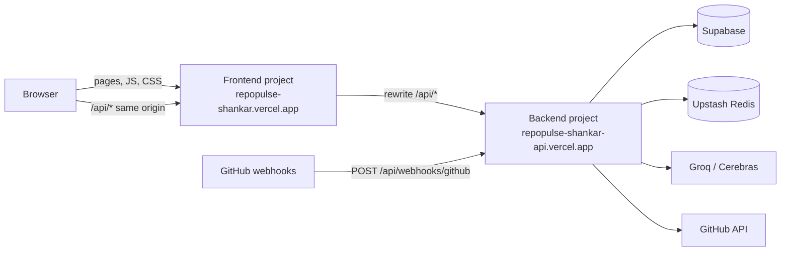

# Deployment

RepoPulse deploys as **two Vercel projects from the same GitHub repository**: one for the
frontend and one for the backend API. The frontend forwards `/api/*` to the backend, so
the browser only ever talks to the frontend domain.

| Part | Where | Root Directory | Config |
|---|---|---|---|
| Frontend (React + Vite) | Vercel project `repopulse-shankar` | `frontend` | `frontend/vercel.json` |
| Backend API (Express) | Vercel project `repopulse-shankar-api` | `backend` | `backend/vercel.json`, `backend/api/index.js` |
| Database | Supabase | — | `supabase/migrations/001`–`007` |
| Cache (optional) | Upstash Redis | — | backend env vars |
| AI (optional) | Groq + Cerebras | — | backend env vars |

The domains used below are `repopulse-shankar.vercel.app` (frontend) and
`repopulse-shankar-api.vercel.app` (backend). If you use other names, replace them
everywhere, including `frontend/vercel.json`.

## How the two projects connect



- **Browser → frontend only.** The app calls relative `/api/...` paths. The frontend
  project's rewrite (`frontend/vercel.json`) proxies them to the backend project and
  passes the response back, including `Set-Cookie`.
- **Why proxy instead of calling the backend domain directly:** the session cookie is
  then set on the frontend domain (first-party, `SameSite=Lax`). Calling another
  `*.vercel.app` domain from the browser would make it a third-party cookie, which
  browsers block. It also means no CORS setup.
- **OAuth goes through the frontend domain.** `BACKEND_URL` (used for the GitHub callback)
  is therefore the **frontend** URL: GitHub redirects to
  `https://repopulse-shankar.vercel.app/api/auth/callback`, which the rewrite forwards
  to the backend.
- **Webhooks go straight to the backend** (`https://repopulse-shankar-api.vercel.app/api/webhooks/github`).
  They are server-to-server and authenticated by signature, not cookies.
- **Secrets live only in the backend project.** The frontend project needs no
  environment variables, and its bundle contains none.

## Prerequisites

- The repository on GitHub, and a Vercel account signed in with GitHub.
- **Your git commit email must belong to your GitHub account** (GitHub → Settings →
  Emails). Vercel blocks git-push deployments whose author email it can't match
  ("could not be matched to a GitHub account"). Check with `git config user.email`.
- Supabase migrations applied (step 1).

## 1. Supabase

1. Create a project.
2. In the **SQL Editor**, run `supabase/migrations/001` → `007` in order. They can run
   as one transaction: wrap them in `begin; … commit;`.
3. Copy the **Project URL** and the **service_role / secret** key for the backend.
   Never use these in the frontend.

## 2. Backend project

1. Vercel → **Add New → Project** → import the repository.
2. **Project Name:** `repopulse-shankar-api`. **Root Directory:** `backend`.
   **Application Preset:** *Other* (the build comes from `backend/vercel.json`; ignore
   Vercel's "Express" or "Services" suggestions).
3. **Environment Variables** (Production and Preview):

| Variable | Value |
|---|---|
| `NODEJS_HELPERS` | `0` — **required**. Vercel's request helpers read the body before Express; webhook signatures then fail and the API answers `SERVER_MISCONFIGURED` |
| `NODE_ENV` | `production` |
| `FRONTEND_URL` | `https://repopulse-shankar.vercel.app` |
| `BACKEND_URL` | `https://repopulse-shankar.vercel.app` — the **frontend** URL (see above) |
| `TOKEN_ENCRYPTION_KEY` | `openssl rand -base64 32`. Keep it stable: changing it signs everyone out |
| `GITHUB_APP_ID`, `GITHUB_CLIENT_ID`, `GITHUB_CLIENT_SECRET`, `GITHUB_WEBHOOK_SECRET` | from the GitHub App (step 5) |
| `GITHUB_APP_PRIVATE_KEY` | the whole `.pem`, including the `-----BEGIN…` / `-----END…` lines |
| `SUPABASE_URL`, `SUPABASE_SERVICE_ROLE_KEY` | step 1 |
| `UPSTASH_REDIS_REST_URL`, `UPSTASH_REDIS_REST_TOKEN` | optional; without them analytics read the database directly |
| `AI_API_KEY` (+ optional `AI_FALLBACK_API_KEY`) | optional; without them the AI page reports "not configured" |

   Do **not** set `PORT` or `WEBHOOK_PROXY_URL` (local development only). Pasting the whole
   local `backend/.env` into Vercel's key field works, but then fix `NODE_ENV`,
   `FRONTEND_URL` and `BACKEND_URL`, delete `PORT` and `WEBHOOK_PROXY_URL`, and add
   `NODEJS_HELPERS`.
4. **Deploy.** Check that
   `https://repopulse-shankar-api.vercel.app/api/health` returns `{"success":true,…}`.
5. Optional: **Settings → Functions → Region** near your Supabase region.

What the backend build does: `npm ci --include=dev` (TypeScript is a dev dependency, and
`NODE_ENV=production` would otherwise skip it) → `tsc` into `dist/` → `api/index.js`
becomes one serverless function that every path is rewritten to. `public/` only holds
`robots.txt`; Vercel requires a static output directory.

## 3. Frontend project

1. If the backend domain is not `repopulse-shankar-api.vercel.app`, edit the rewrite
   destination in `frontend/vercel.json` and push.
2. Vercel → **Add New → Project** → import the **same** repository again.
3. **Project Name:** `repopulse-shankar`. **Root Directory:** `frontend`.
   **Application Preset:** *Vite*.
4. **No environment variables.** In particular leave `VITE_API_BASE_URL` unset; the app
   must call relative `/api` paths.
5. **Deploy.** Check that `https://repopulse-shankar.vercel.app/api/health` returns the
   backend's health JSON. That proves the rewrite connects the two projects.

## 4. Connect and redeploy

If either domain differs from what you entered in step 2, correct `FRONTEND_URL` and
`BACKEND_URL` on the **backend** project (both = frontend URL) and **Redeploy** it.
Environment changes only apply to new deployments.

## 5. GitHub App (production)

Use a separate App from development, or edit the existing one:

| Setting | Value |
|---|---|
| Homepage URL | `https://repopulse-shankar.vercel.app` |
| Callback URL | `https://repopulse-shankar.vercel.app/api/auth/callback` (frontend) |
| Webhook URL | `https://repopulse-shankar-api.vercel.app/api/webhooks/github` (backend) |
| Webhook secret | same as `GITHUB_WEBHOOK_SECRET` |
| Permissions / events | see `architecture/github-app-setup.md` |

Editing the development App moves its callback and webhook to production, so local
sign-in and the smee relay stop working until they are changed back. A separate
production App avoids that; it then needs its own keys in the backend project.

## 6. Verify

- [ ] Backend: `https://repopulse-shankar-api.vercel.app/api/health` → `status: ok`,
      `cache: ok` if Redis is configured.
- [ ] Frontend proxy: `https://repopulse-shankar.vercel.app/api/health` → the same JSON.
- [ ] **Continue with GitHub** signs in and lands on Repositories.
- [ ] **Sync** on a repository finishes with status *Synced*.
- [ ] Overview, Pull Requests, Contributors and Analytics show that repository's data.
- [ ] A PR opened on GitHub appears without a sync, and *Settings → Webhook deliveries*
      shows it *Processed*. GitHub's App settings → *Advanced* lists recent deliveries.
- [ ] *AI Insights → Analyze* returns an answer, or a clear "not configured" message.

Backend logs: backend project → **Logs** (or a deployment's *Runtime Logs*).

## Serverless behaviour of the backend

| Concern | Handling |
|---|---|
| Work after the response (sync, webhook processing) | `waitUntil` keeps the function alive until it finishes (`src/utils/background.ts`) |
| Time limit | `maxDuration: 300` s. Commit-stat fetching stops after 180 s and the next sync continues; an interrupted sync can be restarted after 10 minutes |
| AI per-user limit | Counted in Redis, so it holds across function instances |
| Cold starts | The first request after idle takes a little longer |

## Day-to-day

- **Deploys:** every push to `main` redeploys both projects (each builds only its own
  folder). Pushes to other branches create preview deployments.
- **Environment changes:** edit in Vercel, then **Redeploy** the backend.
- **Migrations:** run the new `supabase/migrations/NNN_*.sql` in the SQL Editor *before*
  pushing code that needs it, then recompute metrics if a metric changed.

| Task | Command (run locally with production values in `backend/.env`) |
|---|---|
| Sync one repository | `npm run sync:repo -- <repositoryId>` |
| Recompute daily metrics | `npm run metrics:recalculate -- <repositoryId>` |

## Troubleshooting

| Symptom | Cause | Fix |
|---|---|---|
| Deployment **Blocked**: commit email "could not be matched to a GitHub account" | git author email not on your GitHub account | Add/verify the email on GitHub, or `git config user.email <github email>`; push a new commit |
| Build fails: `tsc: command not found` | `NODE_ENV=production` skips dev dependencies | Keep `installCommand: npm ci --include=dev` in both `vercel.json` files |
| Build fails: `No Output Directory named "public"` (backend) | `backend/public/` missing | Restore `backend/public/robots.txt` |
| API answers `SERVER_MISCONFIGURED` | `NODEJS_HELPERS` not `0` on the backend | Set it, then Redeploy |
| `/api/...` on the frontend returns 404 or HTML | Rewrite destination wrong | Fix the backend domain in `frontend/vercel.json` |
| GitHub: "redirect_uri is not associated with this application" | Callback URL mismatch | App callback = `<frontend>/api/auth/callback`; `BACKEND_URL` = frontend URL |
| Signed in, but immediately signed out / 401 everywhere | Cookie set for the wrong host | Use the app only via the frontend domain; `BACKEND_URL`/`FRONTEND_URL` = frontend URL |
| Webhook deliveries fail with 401 | Secret mismatch | Same value in GitHub App and `GITHUB_WEBHOOK_SECRET`; Redeploy after changing |
| Sync stays *Syncing* | Function stopped at its time limit | Wait 10 minutes and sync again; the backfill continues |

## Checking a build locally

From `backend/` or `frontend/` (needs `npx vercel link` to the matching project once):

```bash
npx vercel build
```

For the backend, set `NODE_ENV=production` and `NODEJS_HELPERS=0` in the shell first to
match Vercel. The output in `.vercel/output` (git-ignored) shows the function bundle and
routes.
