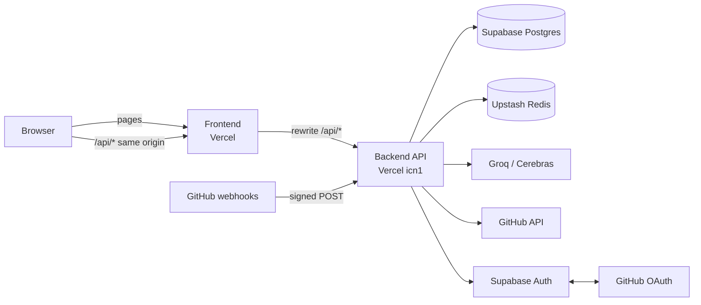

# RepoPulse — Project Guide

A single reference for the whole repository: what RepoPulse is, its unique selling points,
the folder structure, **what every file does**, **admin and member privileges**, the benefits
and the known bottlenecks.

Live: **https://repopulse-shankar.vercel.app** · Last updated 2026-10-05

---

## 1. What RepoPulse is

RepoPulse is a **GitHub engineering-intelligence platform**. It reads a repository's pull
requests, reviews and commits from GitHub, stores them in Postgres, computes delivery
metrics (cycle time, review delay, throughput, PR size, code churn) and shows them on a
dashboard, with AI-written explanations that are checked against the real numbers.

| Layer | Technology | Hosted on |
|---|---|---|
| Frontend | React 18 + Vite + TypeScript, TanStack Query, Tailwind CSS, Recharts | Vercel project `repopulse-shankar` |
| Backend API | Express + TypeScript (native ESM), one serverless function | Vercel project `repopulse-shankar-api` (region `icn1`, Seoul) |
| Database | PostgreSQL (tables, SQL analytics functions) | Supabase (Seoul) |
| Sign-in | GitHub via Supabase Auth (server-side PKCE) + GitHub App | Supabase + GitHub |
| Cache | Redis (read-through, 10 min TTL) | Upstash |
| AI | OpenAI-compatible API: Groq (primary), Cerebras (fallback) | Groq / Cerebras |

## 2. Unique selling points (USP)

1. **Real data only.** No seed or demo data anywhere; every number comes from GitHub.
2. **AI that can't invent numbers.** The model receives only backend-computed metrics;
   every number in its answer is matched against that input, and insights citing anything
   else are removed and reported ("1 insight removed…").
3. **Metrics defined once, in SQL.** Cycle time, review delay etc. are Postgres functions,
   pinned by a hand-computed test fixture, so every screen and the AI agree.
4. **Honest data-quality notes.** Every metric screen shows its caveats (missing commit
   stats, no reviews, small samples) instead of hiding them.
5. **Secure by design.** Read-only GitHub access, per-user repository authorization,
   encrypted GitHub tokens, hashed session tokens, CSRF guard, signed webhooks, and the
   browser never talks to Supabase, Redis, GitHub or the AI provider directly.
   **Two roles** (admin, member) on top of GitHub's own repository access (section 6).
6. **Live updates.** GitHub webhooks update PRs, reviews and commits without a manual sync.
7. **Free to run.** Fits the free tiers of Vercel, Supabase, Upstash and Groq.

## 3. Architecture at a glance



Backend layering (every feature follows it):
**route → controller → service → repository → Supabase**.
Routes declare URLs and middleware; controllers translate HTTP; services hold the logic;
repositories are the only code that talks to the database.

## 4. Folder structure

```
RepoPulse/
├── backend/                 Express API (TypeScript, ESM)
│   ├── api/                 Vercel serverless entry
│   ├── public/              Static output Vercel requires (robots.txt only)
│   ├── scripts/             Dev tools (webhook relay)
│   ├── src/
│   │   ├── config/          Environment, Supabase and GitHub App clients
│   │   ├── routes/          URL → middleware → controller wiring
│   │   ├── controllers/     HTTP in/out for each feature
│   │   ├── middleware/      Auth, admin check, CSRF, validation, errors
│   │   ├── services/        Business logic: auth, admin, github, sync, analytics, cache, ai
│   │   ├── repositories/    Database access (one file per table/area)
│   │   ├── webhooks/        GitHub webhook verification and processing
│   │   ├── schemas/         Shared Zod request schemas
│   │   ├── types/           Backend-internal types
│   │   └── utils/           Crypto, cookies, errors, batching, background work
│   └── tests/               Vitest suites (API, services, real SQL on PGlite)
├── frontend/                React app
│   ├── public/              Static assets (favicon)
│   └── src/
│       ├── pages/           One file per screen (incl. the admin-only Admin page)
│       ├── components/      UI building blocks, grouped by feature
│       ├── hooks/           Data fetching and URL state
│       ├── services/        Typed API client per backend area
│       ├── types/ utils/    Shared types and formatters
│       └── test/            Test setup and render helpers
├── shared/                  API contract types used by both sides
├── supabase/                SQL migrations (001–008; 008 = roles), config, seed placeholder
├── scripts/                 Ops scripts: sync, metric recalculation, set role, live smoke test
├── docs/                    Architecture, database, deployment, requirements
└── (root)                   README, workspace package.json, .env.example, git config
```

## 5. File-by-file reference

### 5.1 Root

| File | What it does |
|---|---|
| `README.md` | Project overview, local setup, commands, links to the docs |
| `package.json` | Workspace scripts that run backend/frontend commands (`npm test`, `npm run typecheck`, `sync:repo`, `test:smoke`, …) |
| `.env.example` | Every backend environment variable with an explanation (no real values) |
| `.gitignore` | Keeps `.env`, `node_modules`, build output and `.vercel/` out of git |
| `.gitattributes` | Normalizes line endings across Windows/macOS/Linux |

### 5.2 `shared/`

| File | What it does |
|---|---|
| `contracts.d.ts` | **The API contract**: every request/response type (Repository, PullRequest, AnalyticsResult, AIInsightResult, SessionInfo, …). Imported by both backend and frontend so they can't drift apart |

### 5.3 `supabase/`

| File | What it does |
|---|---|
| `migrations/001_core_schema.sql` | Core tables: users, github_installations, repositories, contributors, pull_requests, reviews, commits, daily_metrics, webhook_events; `updated_at` triggers |
| `migrations/002_rls.sql` | Enables Row Level Security on every table with deny-all policies; only the backend's service-role key can read/write |
| `migrations/003_views.sql` | Early analytics views (historical; replaced by generated columns and dropped in 004) |
| `migrations/004_integrity_and_access.sql` | Data-integrity fixes (real GitHub timestamps, unknown commit stats as NULL), generated PR metric columns, access tables `user_installations` / `user_repositories`, `sessions` table |
| `migrations/005_sync_engine.sql` | `claim_repository_sync()` (atomic sync lock) and `commits.is_merge` |
| `migrations/006_schema_spec_alignment.sql` | Unique PR number per repo, `html_url` / `is_fork` / `is_archived`, sync and webhook status values |
| `migrations/008_roles.sql` | **Roles**: `users.role` (admin/member) and `suspended_at`; admin functions (list users, overview, set role, suspend, delete) that enforce "always one admin" and "admins can't be suspended/deleted" |
| `migrations/007_analytics_engine.sql` | The metric engine: `repository_period_metrics`, `contributor_activity`, `refresh_daily_metrics`; reshaped `daily_metrics`; `repositories.data_since` |
| `config.toml` | Supabase CLI project config (placeholder project id) |
| `seed.sql` | Intentionally empty: RepoPulse uses real GitHub data only |

### 5.4 `backend/` — configuration and entry points

| File | What it does |
|---|---|
| `package.json` | Backend dependencies and scripts (`dev`, `build`, `test`, `typecheck`, `webhooks:relay`, …) |
| `tsconfig.json` | TypeScript compile settings (NodeNext ESM, strict, `@shared/*` path) |
| `tsconfig.test.json` | Type-checks tests and scripts as well as `src` |
| `vitest.config.mts` | Test runner config with placeholder environment values (tests never read real credentials) |
| `vercel.json` | Vercel build for the backend project: install with dev deps, `tsc`, one function `api/index.js` (300 s, region `icn1`), rewrite every path to it |
| `api/index.js` | **Serverless entry**: hands each request to the Express app; refuses to run if Vercel request helpers are on (`NODEJS_HELPERS=0` required for raw webhook bodies) |
| `public/robots.txt` | Tells crawlers not to index the API; exists because Vercel needs a static output folder |
| `scripts/webhook-relay.ts` | Local development: forwards GitHub webhooks from smee.io to `localhost:3001` |
| `src/server.ts` | Local/server entry: starts Express on `PORT` |
| `src/app.ts` | Builds the Express app: CORS, raw body for webhooks, JSON parser, session auth, CSRF guard, all routers, 404 and error handlers |

### 5.5 `backend/src/config/`

| File | What it does |
|---|---|
| `env.ts` | Loads and **validates every environment variable** with Zod at start-up (blank = unset; defaults for AI providers, lookback, cookies) |
| `supabase.ts` | Supabase client using the service-role key (server only) |
| `github.ts` | GitHub App client (`@octokit/app`) with App id, private key, OAuth client and webhook secret |

### 5.6 `backend/src/routes/`

| File | What it does |
|---|---|
| `health.ts` | `GET /api/health`: liveness plus Redis status |
| `auth.ts` | `GET /api/auth/github` (start sign-in), `/callback`, `POST /logout`, `GET /me` |
| `repositories.ts` | List, discover, detail, start sync, webhook deliveries |
| `analytics.ts` | `GET …/analytics` (full analytics) and `…/metrics` (headline metrics) |
| `pullRequests.ts` | PR list per repository and standalone PR detail (`/api/pull-requests/:id`) |
| `contributors.ts` | Contributor activity per repository |
| `ai.ts` | `POST /api/ai/insights` |
| `admin.ts` | `/api/admin/overview`, `/users`, `PATCH /users/:id` (role, suspend), `DELETE /users/:id`; admins only |
| `webhooks.ts` | `POST /api/webhooks/github` (signature-authenticated, no session/CSRF) |

### 5.7 `backend/src/controllers/`

| File | What it does |
|---|---|
| `authController.ts` | Starts Supabase-backed GitHub sign-in (sets the encrypted PKCE cookie), handles the callback (code exchange, session cookie, retry-once on a reused code), logout, current session |
| `repositoryController.ts` | Lists accessible repos, re-runs discovery, returns repo detail, starts a background sync (202), lists webhook deliveries |
| `analyticsController.ts` | Serves analytics, metrics and contributors through the Redis cache (`X-Cache` header) |
| `pullRequestController.ts` | Paginated/filtered/sorted PR list; PR detail with access check (inaccessible = 404) |
| `aiController.ts` | Validates the AI request and returns structured insights |
| `adminController.ts` | Admin overview, user list, role/suspension updates and deletion (validated) |
| `webhookController.ts` | Verifies and records a delivery, answers 202 immediately, processes it in the background |

### 5.8 `backend/src/middleware/`

| File | What it does |
|---|---|
| `auth.ts` | Resolves the session cookie into `req.auth`; `requireAuth`; per-repository access check (404 when not allowed); CSRF header guard (`X-RepoPulse-Client`); `requireAdmin` (403 for members); suspended accounts refused (`ACCOUNT_SUSPENDED`) |
| `validate.ts` | Zod validation of route parameters |
| `error.ts` | Maps errors to the `{ success:false, error:{code,message} }` envelope; never leaks internals; 404 for unknown routes |

### 5.9 `backend/src/services/`

| File | What it does |
|---|---|
| `auth/supabaseOAuth.ts` | **GitHub sign-in through Supabase Auth**, server-side PKCE: builds the authorize URL, seals the code verifier, exchanges the code, returns the GitHub App user token + refresh token, revokes the Supabase session |
| `auth/authService.ts` | Sign-in orchestration: reads GitHub profile, upserts the user, creates the session, runs discovery; builds session info (installations with "Manage repositories" URLs, install URL) |
| `auth/sessionService.ts` | Creates/resolves sessions (cookie token hashed), stores GitHub tokens encrypted, refreshes them before expiry (single-flight) |
| `github/octokit.ts` | Octokit clients (user, installation, app) with throttling and retries; maps GitHub errors to RepoPulse errors |
| `github/githubService.ts` | GitHub reads RepoPulse needs: repository, PRs updated since, PR details, reviews, commits, commit stats, remaining rate limit |
| `github/normalizer.ts` | Converts GitHub API shapes into database rows (PRs, reviews, commits, contributors; bots, ghosts, merge commits) |
| `github/discoveryService.ts` | Finds the user's App installations and repositories, stores them, replaces the user's access rows |
| `sync/syncService.ts` | **Sync engine**: claims the repo, 180-day first sync then incremental (1 h overlap), commit-stats backfill within rate and time budgets, metric refresh, cache invalidation |
| `sync/ingest.ts` | Shared by sync and webhooks: fetch PR details/reviews, store activity idempotently, backfill commit stats (with deadline) |
| `analytics/analyticsService.ts` | Period windows, current vs previous comparison, data-quality limitations, daily trends, contributor activity, daily-metric refresh |
| `cache/cacheService.ts` | Upstash read-through cache (fast reads, durable invalidation with retries), counters for the AI rate limit; falls back to the database when Redis fails |
| `ai/provider.ts` | Minimal OpenAI-compatible client with primary/fallback providers and timeouts |
| `ai/context.ts` | Builds the only data the model sees (precomputed, formatted metrics and example PRs) |
| `ai/schema.ts` | Strict JSON schema sent to the model + Zod schema that validates its answer |
| `ai/grounding.ts` | Checks that every number in the answer exists in the input (anti-hallucination) |
| `admin/adminService.ts` | Admin actions; refuses actions on your own account (`SELF_ACTION`) |
| `ai/aiService.ts` | Modes (summary, trends, anomalies, bottlenecks, question), prompt, per-user hourly limit (Redis), 6 h answer cache, rejected-insight reporting |

### 5.10 `backend/src/repositories/` (database access)

| File | What it does |
|---|---|
| `userRepository.ts` | Upsert/read users from GitHub profiles (never changes role or suspension); find by login |
| `sessionRepository.ts` | Session rows: create, find valid by token hash (with user), touch, update tokens, delete |
| `installationRepository.ts` | GitHub App installations and the ones a user can see |
| `accessRepository.ts` | User ↔ installation / repository access (authorization source of truth), diffed and revoked in chunks |
| `repositoryRepository.ts` | Repository metadata, list for user, sync claim/success/failure, installation lookup |
| `pullRequestRepository.ts` | PR upserts, filtered/sorted/paginated listing, detail, evidence PRs for AI |
| `reviewRepository.ts` | Review upserts |
| `commitRepository.ts` | Insert new commits, find/save missing line stats |
| `contributorRepository.ts` | Repository-scoped contributor identities |
| `analyticsRepository.ts` | Calls the SQL metric functions and converts Postgres numerics |
| `adminRepository.ts` | Calls the admin SQL functions and maps their rule errors (`LAST_ADMIN`, `TARGET_IS_ADMIN`) |
| `webhookEventRepository.ts` | Records deliveries (duplicate-safe), status transitions, recent deliveries |

### 5.11 `backend/src/webhooks/`, `schemas/`, `types/`, `utils/`

| File | What it does |
|---|---|
| `webhooks/signature.ts` | HMAC-SHA256 verification of `X-Hub-Signature-256` on the raw body (timing-safe) |
| `webhooks/payloads.ts` | Zod shapes for the events RepoPulse handles (pull_request, pull_request_review, push) |
| `webhooks/webhookService.ts` | Receive (verify, dedupe, record) and process (re-fetch PR/reviews/commits from GitHub, refresh metrics, invalidate cache); outcome stored on the event |
| `schemas/common.ts` | Shared Zod schemas: repository/PR ids, `?days=7|30|90` |
| `types/index.ts` | Backend-only types (User, Session, installation, webhook event) + re-export of the shared contract |
| `utils/crypto.ts` | AES-256-GCM encryption for GitHub tokens, random tokens, SHA-256 hashing |
| `utils/cookies.ts` | Cookie names and secure set/clear helpers |
| `utils/errors.ts` | Error classes with codes and HTTP statuses |
| `utils/response.ts` | Success/error JSON envelope helpers |
| `utils/batch.ts` | Concurrency-limited mapping and chunking |
| `utils/background.ts` | `runInBackground` via Vercel `waitUntil`, so work after the response finishes |

### 5.12 `backend/tests/` (Vitest)

| File | What it covers |
|---|---|
| `helpers.ts`, `pglite.ts` | Test users/sessions; in-process Postgres (PGlite) running the real migrations |
| `db.migrations.test.ts` | Migrations apply cleanly; constraints, access tables, sync claim |
| `db.analytics.test.ts` | SQL metric functions against a hand-computed fixture (exact values) |
| `api.foundation.test.ts`, `api.pages.test.ts` | Health, envelopes, validation, pagination, sorting, filters |
| `auth.test.ts`, `supabaseOAuth.test.ts` | Sign-in flow (Supabase mocked / fake Supabase server), sessions, token crypto, CSRF, access 404s, retry-once |
| `sync.test.ts` | Sync windows, renames, contributors, review rules, stats backfill and deadline, failures |
| `normalizer.test.ts` | GitHub → row conversion edge cases |
| `analytics.test.ts` | Comparison, limitations, endpoints |
| `cache.test.ts` | Hit/miss, TTL, invalidation retries, Redis failures, counters |
| `webhooks.test.ts` | Signatures, duplicates, processing per event type |
| `ai.test.ts` | Provider fallback, grounding, caching, limits, failures |
| `admin.test.ts` | Members get 403, CSRF, admin actions, self-protection, rule errors, suspended users signed out and blocked at sign-in |
| `db.roles.test.ts` | Migration 008 on Postgres: default role, last-admin rule, suspension, admin protection, delete keeps repository data |
| `failures.test.ts` | GitHub/database failure mapping, no detail leaks |

### 5.13 `frontend/` — configuration and entry

| File | What it does |
|---|---|
| `package.json` | Frontend dependencies and scripts (`dev`, `build`, `test`, `typecheck`) |
| `vercel.json` | Vercel build for the frontend; **rewrites `/api/*` to the backend project**; SPA fallback |
| `vite.config.ts` | Vite build, `@` and `@shared` aliases, dev proxy `/api` → `localhost:3001` |
| `vitest.config.ts` | jsdom test environment |
| `tsconfig.json` | References the two TypeScript projects below |
| `tsconfig.app.json` | TypeScript settings for the app (`src`), `@` and `@shared` paths |
| `tsconfig.node.json` | TypeScript settings for build tooling (`vite.config.ts`) |
| `tailwind.config.js`, `postcss.config.js` | Design tokens (colors, radius, fonts), class-based dark mode, and CSS processing |
| `index.html` | HTML shell; a tiny inline script applies the saved/system theme before the first paint (no flash) |
| `.env.example` | Optional `VITE_API_BASE_URL` (normally unset) |
| `public/favicon.svg` | Site icon |
| `README.md` | Frontend notes |
| `src/main.tsx` | Mounts React with the query client |
| `src/App.tsx` | Routes; lazy-loaded pages; auth gate |
| `src/index.css` | Tailwind layers and the theme's CSS variables: light by default, `.dark` palette when `<html>` has the `dark` class |

### 5.14 `frontend/src/pages/`

| File | Screen |
|---|---|
| `HomePage.tsx` | Public landing page at `/`: hero, project facts, all features, how it works, **Privacy Policy**, **Terms of Use**, footer with the owner's GitHub and LinkedIn. Uses React Bits animations, static when the visitor prefers reduced motion; theme toggle in the header (app-wide light/dark mode); loaded on demand |
| `LoginPage.tsx` | **Member / Admin** sign-in forms (both GitHub; the admin form only lets admins in and lands on the Admin page); explains sign-in errors; API-unreachable notice; terms and privacy links |
| `RepositoriesPage.tsx` | Repository list with search/filters, Sync, **Manage repositories**, auto-refresh from GitHub, install guidance |
| `OverviewPage.tsx` | Headline metrics with period comparison and data-quality notes |
| `PullRequestsPage.tsx` | PR table: filters, sorting, pagination, detail drawer; state in the URL |
| `ContributorsPage.tsx` | Contributor activity table |
| `AnalyticsPage.tsx` | "This period vs previous" bar comparison, metrics table, and 10 daily trend charts (one unit per chart) |
| `AIInsightsPage.tsx` | Analysis modes, free question, structured insights, clear AI-unavailable/no-activity states |
| `AdminPage.tsx` | **Admins only** (`/admin`): system overview, user list with role/status/activity, make admin/member, suspend/reinstate, delete with confirmation |
| `SettingsPage.tsx` | Sync status, GitHub connection, manage-repositories link, webhook deliveries |

### 5.15 `frontend/src/components/`

| File | What it does |
|---|---|
| `layout/AppShell.tsx` | Sidebar/mobile drawer, repository switcher, outlet context with the current repository |
| `layout/RequireAuth.tsx` | Redirects signed-out users to `/login`; retryable error when the API is down |
| `layout/PageHeader.tsx` | Page title, period selector, actions |
| `layout/AccountMenu.tsx` | Avatar menu: role, **Admin** link for admins, sign-out |
| `dashboard/MetricRow.tsx` | Metric tiles with value, previous value and change |
| `dashboard/DataQualityNotice.tsx` | Always-visible caveats for the numbers on screen |
| `charts/TrendChart.tsx` | Recharts line/bar chart with tooltip and table view; empty periods still draw axes and baseline with a note |
| `charts/PeriodComparison.tsx` | Paired bars per metric (current vs previous period), each scaled to itself, values written beside the bars |
| `charts/Sparkline.tsx` | Tiny inline trend (SVG, no chart library) |
| `charts/theme.ts` | Chart colors per theme (`useChartColors`), since SVG attributes can't read CSS variables; kept separate so small charts don't load Recharts |
| `pullRequests/PullRequestTable.tsx` | Sortable PR table |
| `pullRequests/PullRequestDetailPanel.tsx` | PR detail drawer (timeline, size, reviews) |
| `pullRequests/PullRequestStatusBadge.tsx` | Open/merged/closed badge |
| `contributors/ContributorTable.tsx` | Contributor activity rows |
| `repositories/SyncStatusBadge.tsx` | Never/syncing/synced/failed badge |
| `ai/InsightCard.tsx` | One AI insight: fact, evidence, possible explanation, what to check |
| `reactbits/SplitText.tsx` | React Bits (MIT): word-by-word headline animation (GSAP) |
| `reactbits/ShinyText.tsx` | React Bits: shine sweep over a short label (Motion) |
| `reactbits/CountUp.tsx` | React Bits: numbers count up when scrolled into view (Motion) |
| `reactbits/SpotlightCard.tsx` | React Bits: card with a soft cursor spotlight; styling adapted to the RepoPulse theme |
| `reactbits/AnimatedContent.tsx` | React Bits: fade/slide-in on scroll (GSAP ScrollTrigger) |
| `ui/ThemeToggle.tsx` | Sun/moon button switching light/dark for the whole app; on the home, login, repositories and every dashboard page |
| `ui/*` (`Badge`, `Button`, `Input`, `Pagination`, `Panel`, `SegmentedControl`, `States`, `Table`) | Small, consistent UI primitives; `States` = loading/empty/error |

### 5.16 `frontend/src/hooks/`, `services/`, `types/`, `utils/`, `test/`

| File | What it does |
|---|---|
| `hooks/useSession.ts` | Current user/session query |
| `hooks/useRepository.ts` | Repository list/detail, start sync, polling while syncing |
| `hooks/useAnalytics.ts` | Analytics, PRs, contributors queries keyed by repository and period |
| `hooks/useTheme.ts` | **App-wide light/dark theme**: system setting by default, saved choice (localStorage), synced across toggles and tabs, applied as the `dark` class on `<html>` |
| `hooks/usePeriod.ts` | `?days=7|30|90` kept in the URL so views are shareable |
| `services/api.ts` | Fetch wrapper: relative `/api`, credentials, CSRF header, envelope → typed result or `ApiRequestError` |
| `services/{auth,repository,analytics,pullRequest,contributor,ai,system,admin}Service.ts` | Typed calls for each backend area |
| `types/index.ts` | Re-exports the shared contract types |
| `utils/format.ts` | Duration, date, number and percentage formatting |
| `utils/cn.ts` | Class-name merge helper |
| `test/setup.ts`, `test/render.tsx` | Test environment (incl. a `matchMedia` stand-in reporting reduced motion) and a router/query render helper |

### 5.17 Frontend tests (Vitest + Testing Library, next to the code they test)

| File | What it covers |
|---|---|
| `components/ai/InsightCard.test.tsx` | Insight sections render; hypotheses labelled |
| `components/charts/TrendChart.test.tsx` | Empty periods still draw with a note; table view values |
| `components/charts/PeriodComparison.test.tsx` | Current/previous values and change per metric, legend, collapsed empty rows |
| `components/dashboard/MetricRow.test.tsx` | Values, previous period, change direction |
| `components/layout/RequireAuth.test.tsx` | Redirect when signed out; API-down error without leaking the page |
| `pages/PullRequestsPage.test.tsx` | Listing, sorting via the API, URL state, empty and error states |
| `pages/AIInsightsPage.test.tsx` | No AI call until asked, modes, question, not-configured and no-activity states |
| `pages/AdminPage.test.tsx` | Members blocked, overview and users, no actions on yourself, promote/suspend/delete with confirmation, admins protected, refused actions explained |
| `pages/LoginPage.test.tsx` | Member form by default, switch to the admin form (kept in the URL), not-admin message, signed-in redirects by role |
| `pages/HomePage.test.tsx` | Features, privacy policy and terms present; GitHub/LinkedIn footer links; sign-in and dashboard actions; dark mode default, toggle and remembered choice |
| `pages/RepositoriesPage.test.tsx` | Auto-refresh on open and on return from GitHub, Manage repositories link, guidance |
| `services/api.test.ts` | Envelope parsing, CSRF header, network and non-JSON errors |
| `utils/format.test.ts` | Duration, date and number formatting |
| `hooks/useTheme.test.tsx` | System default, legacy setting kept, whole-document switch, toggles in sync, start-up restore, chart palette per theme |

### 5.18 `scripts/` and `docs/`

| File | What it does |
|---|---|
| `scripts/sync-repository.ts` | `npm run sync:repo -- <id>`: sync one repository and print a summary |
| `scripts/calculate-metrics.ts` | `npm run metrics:recalculate -- <id>`: recompute daily metrics without GitHub |
| `scripts/set-role.ts` | `npm run admin:role -- <login> admin|member`: set a role from the command line (first admin) |
| `scripts/smoke-test.ts` | `npm run test:smoke`: 16 live end-to-end checks; `SMOKE_BASE_URL` targets a deployment |
| `docs/architecture/auth.md` | Sign-in (Supabase PKCE), sessions, authorization |
| `docs/architecture/sync.md` | Sync windows, locking, backfill, time limits |
| `docs/architecture/analytics.md` | Metric definitions and data quality |
| `docs/architecture/webhooks.md` | Webhook flow, dedupe, processing |
| `docs/architecture/cache.md` | Cache keys, TTL, invalidation |
| `docs/architecture/ai.md` | Providers, grounding, limits |
| `docs/architecture/github-app-setup.md` | GitHub App settings, permissions, Supabase Auth setup |
| `docs/database/schema.md` | Tables, generated columns, access model |
| `docs/deployment.md` | Two Vercel projects, env vars, GitHub App/Supabase settings, verification, troubleshooting |
| `docs/requirements/acceptance.md` | Acceptance criteria status |
| `docs/requirements/test-report.md` | Test suites and scenario coverage |
| `docs/project-guide.md` | This document |

## 6. Roles and privileges: admin and member

RepoPulse has **two layers of access**, and both apply to every request:

1. **GitHub access decides which repositories you can see.** You only see repositories
   you can access on GitHub through the RepoPulse GitHub App (`user_repositories`).
   This applies to **everyone, admins included**. A repository you can't access answers
   **404**, so its existence isn't revealed.
2. **Your RepoPulse role decides what you can do in the app itself.** Every user is a
   **member** by default; **admins** additionally manage users and see the system overview.

### 6.1 Privileges by role

| Privilege | Member | Admin |
|---|:---:|:---:|
| Sign in with GitHub on the **Member** form, sign out | ✅ | ✅ |
| Sign in on the **Admin** form (lands on the Admin page) | ❌ refused before any session (`NOT_ADMIN`) | ✅ |
| Install the GitHub App, manage which repositories it can read (on GitHub) | ✅ | ✅ |
| See the repository list (repositories GitHub gives *them* access to) | ✅ | ✅ |
| Refresh repositories from GitHub | ✅ | ✅ |
| Sync a repository they can access | ✅ | ✅ |
| Overview, Pull Requests, Contributors, Analytics, Settings of those repositories | ✅ | ✅ |
| AI Insights on those repositories (20 requests per hour each) | ✅ | ✅ |
| Light/dark theme, home page, legal pages | ✅ | ✅ |
| See repositories GitHub doesn't give them access to | ❌ | ❌ |
| Open the **Admin** page (`/admin`) and the `/api/admin/*` endpoints | ❌ (403 `ADMIN_REQUIRED`) | ✅ |
| See the **system overview** (users, admins, new users, suspended, active sessions, repositories, failed syncs, webhook failures in 24 h) | ❌ | ✅ |
| See the **user list** (username, name, role, status, joined, last active, connected repositories) | ❌ | ✅ |
| **Make another user admin**, or change an admin back to member | ❌ | ✅ |
| **Suspend** a member (signs them out everywhere, blocks sign-in) and **reinstate** them | ❌ | ✅ |
| **Delete** a member's account (account, sessions and access; shared repository data is kept) | ❌ | ✅ |
| Change, suspend or delete **their own** account | ❌ | ❌ (`SELF_ACTION`) |
| Suspend or delete **another admin** | ❌ | ❌ until that admin is changed to member (`TARGET_IS_ADMIN`) |
| Remove the **last** active admin | ❌ | ❌ (`LAST_ADMIN`) |

### 6.2 Rules that always hold

| Rule | Enforced in | Error |
|---|---|---|
| New users are members | `users.role` default `'member'` (migration 008) | — |
| Role is only `admin` or `member` | `users_role_check` constraint, API validation | 400 |
| Members can't reach admin features | `requireAdmin` middleware on `/api/admin`; Admin page shows "Admin access required" | 403 `ADMIN_REQUIRED` |
| At least one active admin exists | `admin_set_role` (SQL, locked so two demotions can't race) | 409 `LAST_ADMIN` |
| Admins can't be suspended or deleted | `admin_set_suspended`, `admin_delete_user` (SQL) | 409 `TARGET_IS_ADMIN` |
| Nobody acts on their own account | `adminService` | 409 `SELF_ACTION` |
| Suspended users are out | Suspension deletes sessions; `authenticate` refuses any remaining session; sign-in refused | 401 / login page "account suspended" |
| The Admin login form lets only admins in | `completeLogin(..., { requireAdmin })` checks the role **before** creating a session; the form choice travels in the `rp_login_as` cookie | 403 → login page "isn’t a RepoPulse admin" |
| Admin changes need the CSRF header | `requireClientHeader` covers `/api/admin` | 403 `CSRF_HEADER_MISSING` |
| Only the backend can call the admin SQL functions | `revoke … from anon, authenticated`; granted to `service_role` only | — |

### 6.3 How roles are assigned

- **Everyone starts as member** on first sign-in.
- **The first admin** is set from the command line (the user must have signed in once):
  `npm run admin:role -- <github-login> admin`. Also use it to recover if needed.
- **After that, admins manage roles** on the Admin page (account menu → **Admin**, or sign in
  on the login page's **Admin** form to land there directly).
- **Choosing a form doesn't change your role.** The Admin form only checks it.
- Signing in again never changes a role or a suspension; only admins (or the command) do.

### 6.4 How to sign in: member and admin

The login page (`/login`) has two forms, switched with **Member | Admin** at the top. Both
sign in with GitHub; RepoPulse has no passwords. The chosen form is part of the address,
so it can be bookmarked or shared.

| | **Member** form | **Admin** form |
|---|---|---|
| Address | `https://repopulse-shankar.vercel.app/login` | `https://repopulse-shankar.vercel.app/login?as=admin` |
| For | Everyone | Accounts that already have the **admin** role |
| Button | **Continue with GitHub** | **Sign in as admin with GitHub** |
| After GitHub approval | Signed in → **Repositories** | Admin → signed in → **Admin** page. Member → **refused, not signed in**, back on the Admin form |
| Can it grant admin? | — | **No.** It only checks the existing role |

**Member: step by step**

1. Open `/login` (the **Member** form is selected).
2. Click **Continue with GitHub** and approve RepoPulse on GitHub (first time only).
3. On **Repositories**: if you see *Install the GitHub App to get started*, click
   **Install GitHub App**, choose your account and **All repositories**, then come back;
   the list refreshes by itself.
4. Click **Sync** on a repository, then open it for Overview, Pull Requests,
   Contributors, Analytics and AI Insights.

**Admin: step by step**

1. Open `/login?as=admin` (or `/login` and click **Admin**).
2. Click **Sign in as admin with GitHub** and approve on GitHub if asked.
3. You land on the **Admin** page: system overview and users. Repositories and dashboards
   work exactly as for members (account menu → back to the app).
4. Already signed in through the Member form? Open the account menu → **Admin**; no
   second sign-in is needed.

**What each message means**

| Message on the login page | Why | What to do |
|---|---|---|
| *This GitHub account isn’t a RepoPulse admin…* | A member used the Admin form | Use the **Member** form, or ask an admin to change your role |
| *This account has been suspended…* | An admin suspended the account | Contact a RepoPulse admin |
| *GitHub authorization was cancelled.* | **Cancel** was clicked on GitHub | Try again and approve |
| *The sign-in attempt expired or was started in another tab.* | More than 10 minutes, or another tab | Start again from the same tab |
| *The GitHub sign-in link was already used or has expired.* | The GitHub return link was opened twice | Click the sign-in button again |
| *Can’t reach the RepoPulse API.* | The backend is down or starting | Wait a moment and click **Retry** |

**Why a member can never get in as admin**

| Attempt | Result | Enforced by |
|---|---|---|
| Use the **Admin** form | Refused **before any session is created**; not signed in (`NOT_ADMIN`) | `authService.completeLogin(..., { requireAdmin })` |
| Sign in as member, then open `/admin` | "Admin access required"; no admin data loaded | `AdminPage` + API below |
| Call `/api/admin/*` directly | **403 `ADMIN_REQUIRED`**; nothing read or changed | `requireAdmin` middleware |
| Edit the URL, cookies or browser storage | No effect: the role is read from the database on every request | `authenticate` middleware |
| An admin is changed back to member | Loses admin access on their next request, without signing out | role re-read per request |

Covered by `backend/tests/auth.test.ts` (admin form), `backend/tests/admin.test.ts`,
`frontend/src/pages/LoginPage.test.tsx` and `frontend/src/pages/AdminPage.test.tsx`.

### 6.5 Where it is implemented

| Layer | Files |
|---|---|
| Database | `supabase/migrations/008_roles.sql` (columns, constraint, `admin_*` functions, grants) |
| Shared types | `shared/contracts.d.ts`: `UserRole`, `SessionUser.role`, `AdminOverview`, `AdminUser`, `AdminUserUpdate` |
| Backend access checks | `backend/src/middleware/auth.ts` (`requireAdmin`, suspended sessions), `backend/src/services/auth/authService.ts` (blocked sign-in, role in session info) |
| Backend admin feature | `routes/admin.ts` → `controllers/adminController.ts` → `services/admin/adminService.ts` → `repositories/adminRepository.ts` |
| Backend user data | `repositories/userRepository.ts`, `repositories/sessionRepository.ts` (role and suspension on every request) |
| Frontend | `pages/AdminPage.tsx`, `services/adminService.ts`, `components/layout/AccountMenu.tsx` (role + Admin link), `pages/LoginPage.tsx` (Member/Admin forms, not-admin and suspended messages) |
| Command line | `scripts/set-role.ts` (`npm run admin:role`) |
| Tests | `backend/tests/admin.test.ts`, `backend/tests/auth.test.ts` (admin form), `backend/tests/db.roles.test.ts`, `frontend/src/pages/AdminPage.test.tsx`, `frontend/src/pages/LoginPage.test.tsx` |
| Docs | `docs/architecture/auth.md` (Roles), `docs/database/schema.md`, `docs/deployment.md` (First admin) |

## 7. Benefits

| For | Benefit |
|---|---|
| Developers | See how fast PRs get reviewed; keep PRs small with size feedback |
| Team leads | Spot bottlenecks (slow first review, large PRs, overloaded reviewers) early; check whether process changes help |
| Managers | Period-over-period trends instead of anecdotes; AI summaries written for humans |
| Security-minded teams | Read-only, per-user access; no secrets in the browser; encrypted tokens |
| Admins | Manage who uses RepoPulse: roles, suspension, account deletion, system health at a glance |
| Operators | Free-tier hosting, no servers to manage, live smoke test, clear docs |
| Students / portfolio | A complete, deployed, tested full-stack product on real data |

Quality evidence: **247 backend + 68 frontend automated tests**, live smoke test **16/16**
on production, every API endpoint checked against the shared contract.

## 8. Bottlenecks and limitations

| # | Bottleneck | Impact | Mitigation / next step |
|---|---|---|---|
| 1 | **Vercel 300 s function limit** | The first 180-day sync of a very busy repository may not finish | Commit stats stop after 180 s and the next sync continues; planned: resumable chunked sync |
| 2 | **GitHub rate limits** (5,000 requests/hour per installation) | Large first syncs and commit-stat backfills are throttled | Rate-limit reserve, per-sync caps, throttling and retries in Octokit |
| 3 | **Cold starts** (serverless) | First request after idle takes 1–2 s | Inherent to the free plan; keep-warm or paid plan if needed |
| 4 | **Cross-region latency** | Each request ~0.5 s from India (function and DB in Seoul) | Was 0.8–1.8 s before moving the function next to the database |
| 5 | **Shared free-tier quotas** | All users share Supabase/Upstash/Groq limits; heavy AI use can hit Groq's daily cap | Per-user AI limit (20/hour), 6 h AI answer cache, Cerebras fallback |
| 6 | **GitHub App repository selection** | With "Only select repositories", every repo must be added by hand | "Manage repositories" link + guidance to choose "All repositories"; auto-refresh on return |
| 7 | **Webhooks need the App's events** | Updates arrive only for subscribed events (PRs, reviews, pushes) | Manual/scheduled sync covers the rest; planned: daily cron sync |
| 8 | **Metric limitations** | Daily buckets are UTC; bots count as contributors; reviews need a second person | Planned: timezone setting, bot filter |
| 9 | **AI is interpretive** | Explanations are hypotheses, not facts | Labelled as such; numbers are grounded; analytics never depend on AI |
| 10 | **Single-region, single-instance services** | No high availability beyond the providers' own | Acceptable for this scale; Supabase stays the source of truth if Redis fails |
| 11 | **Roles are app-wide** | An admin manages every user; there are no per-team or per-organization admins | Fine for one operator; team-scoped roles would need an extra table |
| 12 | **Tailwind 3 build-time advisory** (`braces`) | Build tooling only, never shipped to browsers | Planned: Tailwind 4 migration |

## 9. Where to start reading the code

1. `shared/contracts.d.ts` — what the API returns.
2. `backend/src/app.ts` — how requests flow.
3. `backend/src/services/sync/syncService.ts` — how data gets in.
4. `supabase/migrations/007_analytics_engine.sql` — how metrics are defined.
5. `frontend/src/App.tsx` and `frontend/src/pages/OverviewPage.tsx` — how it is shown.
